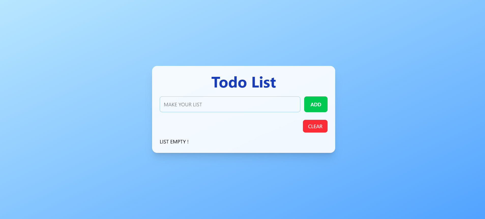
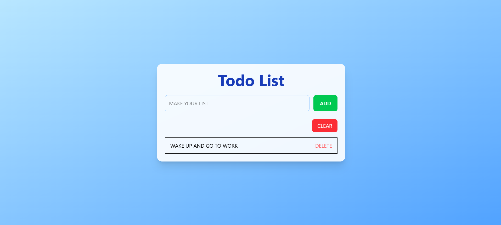

# 📝 Todo List Application

A simple and clean **Todo List** web application where users can add, and delete their daily tasks. Designed with usability in mind.

---

## 🔗 Live Demo

👉 [Click here to see the live app](https://dalveli.github.io/Todo-List/)

---

## 📸 Screenshots

### Main Interface



### Task Added



---

## ✨ Features

- ✅ Add new tasks
- 🗑️ Delete tasks
- 📱 Responsive design

---

## 💻 Technologies Used

- HTML5
- CSS3
- JavaScript (Vanilla)

---

## ⚙️ Getting Started

To run this project locally:

```bash
git clone https://github.com/dalveli/Todo-List.git
cd Todo-List
open index.html
